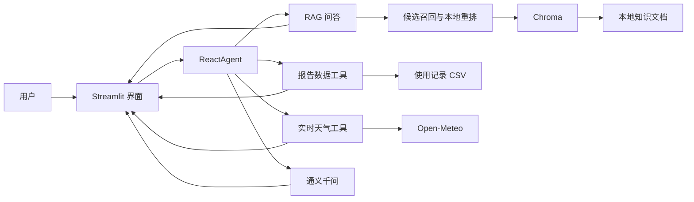

# 智扫通：RAG 与 Agent 驱动的扫地机器人智能客服

智扫通是一个面向扫地机器人使用场景的智能客服项目。项目基于 Streamlit、LangChain、通义千问和 Chroma 构建，将知识库检索、实时天气、设备使用月报、多轮上下文和工具编排整合到统一聊天界面中。

项目适合作为 RAG、Agent、工具调用和大模型应用工程的学习或展示项目。

## 功能特性

- 扫地机器人选购、维护、保养和故障问答
- 基于本地知识文档的 RAG 检索增强生成
- 回答附带真实知识库文件来源
- Open-Meteo 实时天气查询，无需天气 API Key
- 指定用户与月份的设备使用月报
- 最近多个月使用趋势分析
- 天气与清洁建议、报告与保养建议等多工具组合
- 用户、月份和城市会话上下文
- 多轮对话记忆
- 模型调用、工具调用和输入字符统计
- Markdown 对话导出
- 路由回归评估集

## 技术栈

| 模块 | 技术 |
| --- | --- |
| 前端 | Streamlit |
| 大模型 | 通义千问 `qwen3-max` |
| Embedding | DashScope `text-embedding-v4` |
| Agent | 自定义轻量 ReAct 路由与工具编排 |
| RAG | LangChain |
| 向量数据库 | Chroma |
| 文档处理 | LangChain Text Splitters、PyPDF |
| 配置 | YAML |
| 天气 | Open-Meteo |

## 系统架构



## 项目结构

```text
.
├── agent/
│   ├── react_agent.py          # 意图路由、上下文记忆和工具编排
│   └── tools/
│       ├── agent_tools.py      # 天气、报告、RAG 等工具
│       └── middleware.py       # 工具与模型调用中间件
├── config/
│   ├── agent.yml               # Agent 与缓存配置
│   ├── chroma.yml              # 向量库和分片配置
│   ├── prompts.yml             # 提示词路径
│   └── rag.yml                 # 模型参数
├── data/
│   ├── external/records.csv    # 演示用设备使用数据
│   └── *.txt                   # 扫地机器人知识文档
├── model/factory.py            # 模型工厂
├── prompts/                    # 系统、RAG 和报告提示词
├── rag/
│   ├── rag_service.py          # 检索、重排、生成和引用
│   └── vector_store.py         # 文档切片与 Chroma 管理
├── utils/                      # 配置、日志、文件与路径工具
├── app.py                      # Streamlit 应用入口
├── evaluate.py                 # 轻量路由回归评估
├── evaluation_cases.json       # 评估用例
└── requirements.txt
```

## 环境要求

- Python 3.8 或更高版本
- 可访问 DashScope API
- 可访问 Open-Meteo 实时天气接口

## 快速开始

### 1. 克隆项目

```bash
git clone <your-repository-url>
cd <repository-directory>
```

### 2. 创建虚拟环境

Windows PowerShell：

```powershell
python -m venv .venv
.\.venv\Scripts\Activate.ps1
```

Linux 或 macOS：

```bash
python -m venv .venv
source .venv/bin/activate
```

### 3. 安装依赖

```bash
pip install -r requirements.txt
```

### 4. 配置通义千问 API Key

Windows PowerShell：

```powershell
$env:DASHSCOPE_API_KEY="你的 DashScope API Key"
```

Linux 或 macOS：

```bash
export DASHSCOPE_API_KEY="你的 DashScope API Key"
```

也可以参考 `.env.example` 配置自己的环境变量管理方式。请勿将真实 API Key 提交到 GitHub。

### 5. 构建知识库

首次运行 RAG 前执行：

```bash
python rag/vector_store.py
```

程序会读取 `data/` 中允许的知识文件，完成切片、Embedding 并写入本地 Chroma 数据库。

### 6. 启动应用

```bash
streamlit run app.py
```

在浏览器中打开 Streamlit 提供的本地地址即可使用。

## 使用示例

### 知识库问答

```text
滚刷被毛发缠绕应该怎么处理？
小户型应该如何选择扫地机器人？
拖地效果变差可能有哪些原因？
```

### 实时天气

```text
今天西安天气怎么样？
北京现在多少度？
西安下雨天适合使用机器人拖地吗？
```

### 使用报告

```text
生成用户1004在2025年1月的月报
查看用户1010最近三个月的使用趋势
生成用户1004在2025年1月的耗材建议报告
```

## Agent 路由

项目优先使用本地意图识别确定执行路径，减少无意义的模型调用：

| 意图 | 示例 | 处理方式 |
| --- | --- | --- |
| `weather` | 西安实时天气 | Open-Meteo |
| `report` | 生成用户月报 | CSV + 千问分析 |
| `rag` | 滚刷如何保养 | Chroma + 千问 |
| `weather_advice` | 下雨天适合拖地吗 | 天气 + RAG + 千问 |
| `report_advice` | 根据月报给耗材建议 | 报告 + RAG |
| `general` | 普通交流 | 千问 |

## RAG 流程

1. 加载 TXT 或 PDF 知识文档。
2. 使用递归文本切分器生成文档分片。
3. 保存来源、文件类型和分片序号等 metadata。
4. 使用 DashScope Embedding 写入 Chroma。
5. 查询时先扩大候选召回。
6. 根据问题关键词执行本地重排和去重。
7. 将最相关资料交给千问生成回答。
8. 程序从 metadata 提取并附加引用来源。

## 配置说明

### 模型配置

`config/rag.yml`：

```yaml
chat_model_name: qwen3-max
embedding_model_name: text-embedding-v4
temperature: 0.2
max_tokens: 900
```

### Agent 配置

`config/agent.yml` 可以配置：

- 默认用户
- 默认城市
- 最大历史轮数
- 最大回答长度
- 天气缓存时间
- RAG 缓存大小

### 向量库配置

`config/chroma.yml` 可以配置：

- Collection 名称
- 持久化目录
- 检索数量
- 分片大小
- 分片重叠
- 支持的知识文件类型

修改知识文档或切片配置后，建议删除本地 `chroma_db/` 与 `md5.text` 的对应记录，再重新构建知识库。

## 回归评估

项目包含轻量评估用例，可检查天气、报告、RAG 和组合工具路由：

```bash
python evaluate.py
```

评估集位于 `evaluation_cases.json`，可以继续添加业务问题和预期意图。

## 数据与安全说明

- `data/external/records.csv` 是演示数据，不代表真实用户记录。
- 实时天气来自 Open-Meteo，天气结果可能与其他天气平台存在小幅差异。
- 不要将 API Key、`.env`、日志和本地向量数据库提交到 GitHub。
- 在真实业务中，应增加用户认证、权限检查、敏感数据脱敏和 API 限流。

## 后续计划

- 使用模型结构化输出增强复杂意图识别
- 增加会话持久化和历史会话管理
- 增加 RAG 相关性阈值和更专业的 reranker
- 增加报告图表与 PDF 导出
- 增加回答质量、引用准确率和模型 token 的评估
- 提供 FastAPI 服务接口和前后端分离版本

## 许可证

当前仓库默认仅用于学习和项目展示。如果准备开放给其他人复用，建议在发布前选择并添加合适的开源许可证，例如 MIT License。
